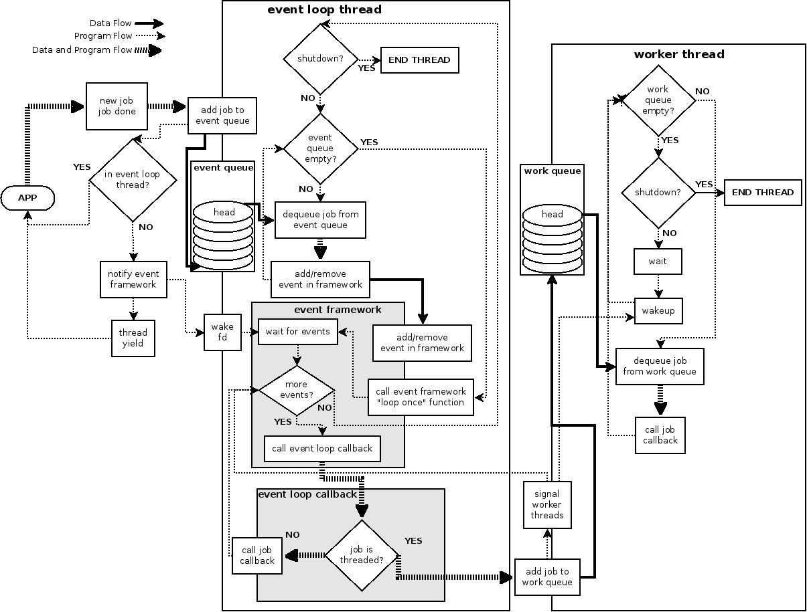

Nunc Stans
==========
Nunc Stans is an event framework wrapper that provides a thread pool for event
callback execution.  It provides thread safety to event frameworks by isolating
and protecting the thread safe parts from the non-thread safe parts, and allows
multi-threaded applications to use event frameworks that are not thread safe.
It has been primarily developed using [libevent](http://libevent.org "libevent
home page") , but has also been tested with [tevent](https://tevent.samba.org
"tevent home page").   Nunc Stans uses lock free data structures where possible,
to avoid mutex contention. The ​[liblfds](http://liblfds.org "Lock Free Data Structure")
library is used.

There are two main components: the *event loop thread and queue*, and the
*worker threads and queues*.  The basic concept is the
[Thread Pool Pattern](https://en.wikipedia.org/wiki/Thread_pool_pattern "Thread
Pool Pattern description"), where the primary source of tasks (*job* in nunc
stans) for the task queue (the *work queue* in nunc stans) is provided by the
event framework for I/O, timer, and signal events.

License
-------
Nunc Stans is licensed under the GNU General Public License version 3 or later.
Nunc Stans also provides an exception for the use of OpenSSL.  See the files
'COPYING', 'COPYING.openssl', and 'COPYING.liblfds' for more information.

Event Loop Thread And Queue
---------------------------

The event queue is essentially the "main loop" of the application.  It runs in
its own thread.  The event queue thread is the only thread that interfaces with
the event framework - adding events, removing events, and
issuing the callbacks when the event is triggered.  This guarantees that all
interactions with the event framework are performed in a thread safe manner.
When a threaded application wants to be called back because of some event (I/O,
timer, signal), it posts the event and callback data to the event queue.  All
interaction with the event queue is thread safe - multiple threads can post
requests to the event queue at the same time.  The event loop thread dequeues
all of the event requests from the event queue, creates/removes
events, then calls the event waiting function of the event framework.  This
assumes the underlying event framework has a function that allows waiting for a
single event - something like `event_base_loop()` in libevent, or
`tevent_loop_wait()` in tevent.

When the application wants events to be triggered as soon as possible, but the
event framework is waiting for very long lived events, the event queue has a
persistent I/O listener called the *event_q_wakeup_pipe*.  When the application
adds an event, nunc-stans will write to the pipe, which will cause the event
framework to immediately wake up and add the pending events, then do a thread
yield to allow the event framework thread to execute.

When an event is triggered by I/O, timer, or signal, the event callback is
called.  The callback can either be run in the event loop thread, or can be
handed off to the *work queue* for execution in a *worker thread*.  The
application uses the flag *NS_JOB_THREAD* to specify that a job will be
executed in a worker thread.

**NOTE:** Jobs executed in the event loop thread don't need locking if they
don't use resources shared with other threads.  This corresponds to a single
threaded app where all jobs are run inside the main loop and no locking is
required.  However, just as in that case, jobs run in the event loop thread
must be very careful to execute very quickly and not block on I/O or other
resources.  This can lead to event starvation.

Worker Threads and Queues
-------------------------

When a job is placed on the *work queue*, it will be executed in a *worker
thread*.  The number of worker threads is specified when nunc stans is
initialized.  Each worker thread sleeps on a condition variable
(e.g. `pthread_cond_wait()`).  When a job is placed on the work queue, nunc
stans will notify the condition variable, waking up one of the worker threads.
This worker thread will dequeue the job from the work queue and execute it.
The work queue is thread safe - the event loop thread can enqueue jobs at the
same time as the worker threads dequeue jobs.  Note that the worker threads
only execute jobs which have the *NS_JOB_THREAD* flag.  Jobs without this flag
will be executed in the event loop thread.

Diagram
-------

Diagram Explanation
-------------------

The solid thick lines represent the flow of data, typically an `ns_job_t`
object.  The small dotted lines represent the flow of the program, or the flow
of control.  In the case of the signal and notification events, these represent
the program sending a signal or notification, but not yielding control.  The
thick dashed lines represent the flow of data and program i.e. a function that
takes an `ns_job_t` object and is the primary program path.  The *event queue*
and the *work queue* are thread safe FIFO/queue objects.  The bottom of the
stack of ellipses is the tail and the top is the head, labeled "head".  The
shaded box labeled "event framework" is the event framework (e.g. libevent).
The boxes that are partially in and partially outside of the event framework
are functions that take nunc stans objects and convert them into the format
used by the event framework.  Note that the "add/remove event in
framework" function will pass ownership of the job into the event framework, so
that the event framework will opaquely own that data in the case of add events.
The shaded box labeled "event loop callback" is called by the
event framework for each triggered event.  The event loop callback will either
execute the job immediately (for non-threaded jobs) or queue the job on the
work queue for execution by a worker thread (for threaded jobs - the
`NS_JOB_THREADED` job flag).

The event loop thread and the worker threads are represented by large boxes.
Everything in the box happens inside that thread.  The boxes that are partly
inside and partly outside represent functions (e.g. the functions to
add/delete an event job) and data structures (the event queue, the
wakeup fd) that are thread safe or are otherwise protected and can be accessed
both from within and outside of the thread.  Although the diagram shows only 1
worker thread, there will usually be more than one, and they all share the same
work queue, which is thread safe.

The usual starting point is the application represented by the **APP** icon on
the left side.  The application will typically create a new event job (e.g. a
network socket listener).  The job will be handed off to the event queue for
processing by the event loop thread.  If this is not happening inside the event
loop thread, the event framework will be notified.  This is necessary because
the event framework could be waiting for a very long time if there are no I/O
or signals happening, or if the timer jobs are very long lived.  This will
wakeup the event framework immediately so that it will loop back around to
process the events in the event queue.  The event loop will dequeue all of the
jobs from the event queue and perform the appropriate add/remove job in
the event framework.  This ensures that only the single event loop thread, not
multiple threads, will interact with the event framework.  Then the event
framework will wait for events.  Once an event is triggered, the event
framework will iterate through all of the triggered events and call the event
loop callback for each one.  This callback will either execute the job
immediately or add the job to the work queue for a worker thread.  This will
also signal the worker threads (e.g. something like `pthread_cond_wait`) to
notify them that there is a new job for processing.  Once all of the events are
processed, the event loop goes back to the top to see if there are more events
to process.  The worker thread signal will typically wake up 1 of the worker
threads, which will dequeue the job and execute it.

Note that the job callback is called both with the data (the `ns_job_t` object)
and the program flow.  This callback is entry point into the application.  It
is the responsibility of the callback to manage the `ns_job_t` object, either
by calling `ns_job_done` to dispose of it safely, or by calling `ns_job_rearm` to
"re-arm" the event.  If the
job is not a threaded job, it is executed in the event loop thread, and can
block all other events from being processed, so great care must be taken not to
perform any long running task or otherwise block the thread.
