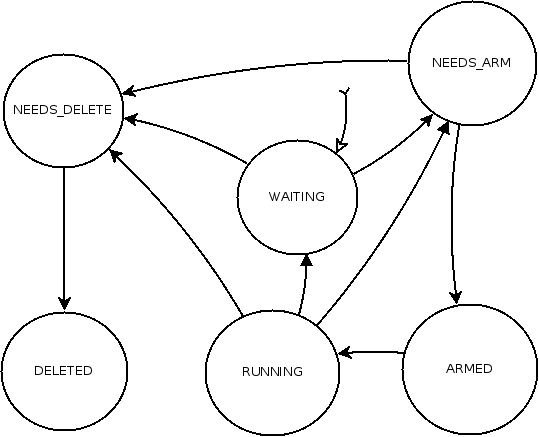

Nunc Stans Job Safety
=====================

Nunc Stans 0.2.0 comes with many improvements for job safety. Most consumers of
this framework will not notice the difference if they are using it "correctly",
but in other cases, you may find you have error conditions.

Jobs now flow through a set of states in their lifetime.

States
------

* WAITING: This represents a job that is idle, and not owned by a worker or event thread. Any thread can alter this job.
* NEEDS_DELETE: This represents a job that is marked for deletion. It cannot be accessed again!
* DELETED: This represents a job that is deleted. In theory, you can never access a job in this state.
* NEEDS_ARM: This is a job that is about to be placed into the event or work queue for arming, but has not yet been queued.
* ARMED: This is a job that is currently in the event queue or work queue waiting to be executed.
* RUNNING: This is a job that is in the process of executing it's callback right now.

Diagram
-------

WAITING
-------

All jobs start in the WAITING state. At this point, the job can have two transitions. It is sent to ns_job_done, and marked as NEEDS_DELETE, or it can be sent to ns_job_rearm, and marked as NEEDS_ARM. A job that is WAITING can be safely modify with ns_job_set_* and accessed with ns_job_get_* from any thread.

NEEDS_ARM
---------

Once a job is in the NEEDS_ARM state, it can not be altered by ns_job_set_*. It can be read from with ns_job_get_*. It can be sent to ns_job_done (which moves to NEEDS_DELETE), but generally this is only from within the job callback, with code like the following.

    callback(ns_job_t *job) {
        ns_job_rearm(job);
        ns_job_done(job);
    }

NEEDS_ARM in most cases will quickly move to the next state, ARMED

ARMED
-----

In the ARMED state, this means that the job has been sucessfully queued into the event *or* work queue. In the ARMED state, the job can be read from with ns_job_get_*, but it cannot be altered with ns_job_set_*. If a job could be altered while queued, this could cause issues with the intent of what the job should do (set_data, set_cb, set_done_cb) etc.

A job that is ARMED and queued can NOT be removed from the queue, or stopped from running. This is a point of no return!

RUNNING
-------

In the RUNNING state, the job is in the process of executing the callback that the job contains. While RUNNING, the thread that is executing the callback may call ns_job_done, ns_job_rearm, ns_job_get_* and ns_job_set_* upon the job. Note, that calling both ns_job_done and ns_job_rearm from the callback, as the 'done' is a 'stronger' action we will delete the job even though rearm was also called.

While RUNNING other threads (ie, not the worker thread executing the callback) may only call ns_job_get_* upon the job. Due to the design of the synchronisation underneath, this will block until the execution of the callback, so for all intents and purposes by the time the external thread is able to call ns_job_get_*, the job will have moved to NEEDS_DELETE, NEEDS_ARM or WAITING.

NEEDS_DELETE
------------

When you call ns_job_done, this marks the job as NEEDS_DELETE. The deletion actually occurs at "some later point". When a job is set to NEEDS_DELETE, you may *not* call any of the ns_job_get_* and ns_job_set_* functions on the job.

DELETED
-------

This state only exists on the job briefly. This means we are in the process of deleting the job internally. We execute the ns_job_done_cb at this point, so that the user may clean up and free any data as required. Only the ns_job_done_cb thread may access the job at this point.

Putting it all together
-----------------------

This state machine encourages certain types of work flows with jobs. This is because the current states are opaque to the caller, and are enforced inside of nunc-stans. The most obviously side effect of a state machine violation is a ASSERT failure with -DDEBUG, or PR_FAILURE from get()/set(). This encourages certain practices:

* Only single threads should be accessing jobs. This prevents races and sync issues.
* Data and variables should exist in a single job. Avoid shared (heap) memory locations!
* Changing jobs should only happen from within the callback, as you can guarantee a consistent state without needing to spin/block on ns_job_set_*.
* You may not need mutexes on your data or thread locals, as the job provides the correct cpu synchronisation guarantees. Consider that each job takes a "root" data node, then all other allocated variables are referenced there only by the single thread. You can now dispose of mutexes, as the job will guarantee the synchronisation of this data.
* Jobs work well if stack variables are used inside the callback functions, rather than heap.

Some work flows that don't work well here:

* Having threads alter in-flight jobs. This causes race conditions and inconsistencies.
* Sharing heap data via pointers in jobs. This means you need a mutex on the data, which causes a serialisation point: Why bother with thread pools if you are just going to serialise on some data points anyway!
* Modifying jobs and what they handle. Don't do it! Just ns_job_done on the job, and create a new one that matches what you want to do.
* Map reduce: Nunc-Stans doesn't provide a good way to aggregate data on the return, IE reduce. You may need to provide a queue or some other method to reduce if you were interested in this.

Examples
--------

Inside of the nunc-stans project, the tests/cmocka/stress_test.c code is a good example of a socket server and socket client using nunc-stans that adheres to these principles.

